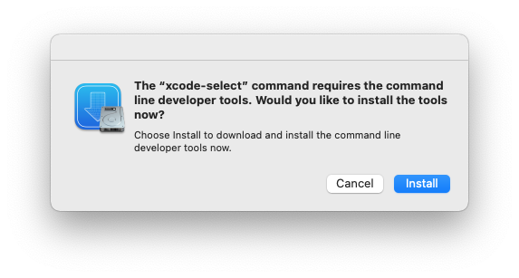
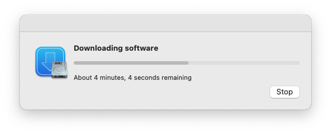
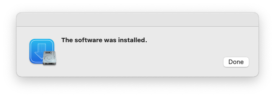

# C语言环境配置  

<span style="color: gray">作者：Махно</span>

## 前言  

C语言程序设计是计算机学科的基础课程，它简洁地展示了编程语言的基本使用逻辑，并深度地结合了计算机的基础硬件特性。

然而一年又一年，C语言编程环境的配置却是是困扰大一CS类新生的老大难问题。黑乎乎的命令行窗口、错综复杂的文件路径、藏在犄角旮旯里又十分重要的设置窗口，即时配置好了也会仅因不起眼的稍加改变而无法使用，并给出难以理解的错误原因。  

这令人困扰的一切共同构成了大学学业最初半年乃至一年的噩梦，消磨着新生的意志，以至于将原本缤纷多彩的计算机学习变成枯燥乏味的苦役。  

本文从实用角度出发，讲解在常用操作系统上配置C语言环境的基本步骤及后续的使用方法。  

注意:
1. 本文仅给出了C语言环境的配置方法及其相关问题，而不包含C语言的具体语法和其使用。  

2. 本文提供的环境配置是适应C语言教学课程的轻量环境，如果后续有C/C++工程的需要，请进行进阶的配置或直接使用成品IDE。  

## 基础知识

编译器(Compiler):将C语言翻译为机器语言从而让计算机可以运行的程序。这个程序在Windows操作系统上将C语言源代码转化为了.exe可执行文件。  

编辑器(Editor):编写文本的程序，例如记事本Notepad.exe就是一个编辑器  

在C语言的编码过程中，程序员用编辑器，编写C语言代码，编写完成后将代码交由编译器编译，得到最终的程序。  

## Windows系统下

### 方案1: 使用微软MSVC编译器+Visual Studio Code编辑器

#### 1.安装MSVC编译器  

### 最佳方案：使用XCode+Visual Studio Code编辑器

## macOS系统下
<span style="color: gray">作者私货:说macOS不适合工科，这句话对CS类专业是不适用的。正确使用你的Mac，它能成为一款比Windows设备还要高效的学习工具。</span>

#### 1.安装XCode编程基础包
通过"聚焦搜索"（一般是cmd+空格）打开"终端"  
  
终端中键入
```sh
xcode-select --install
```
并回车，将会出现  
  
按下"安装"，等待安装完成。  
  
  
再次回到终端，键入  
```sh
clang --version
```
显示  
  
即告安装完成

#### 2.配置Visual Studio Code 编辑器
从官方网站[Visual Studio Code](https://code.visualstudio.com)下载最新版Visual Studio Code，单击按钮下载并安装。具体地，将图标拖到“应用程序”文件夹下面。  
  
在启动台中打开Visual Studio Code，看到如下界面，说明启动成功。  
  
点开“拓展”，搜索C/C++插件并安装。  
  
回到访达，创建专用于C语言练习的工作文件夹，我选择的路径是
```sh
/Users/你的用户名/C-learning
```

用vscode 打开文件夹，通过菜单栏的文件->打开文件夹来打开刚才的文件夹。如果询问是否信任该文件夹我们当然选信任，因为这是我们自己创建的嘛。  
  
在vscode的文件管理器中创建.vscode文件夹，在vscode中创建两个文件，分别命名为launch.json和tasks.json，然后复制如下的内容。
tasks.json:
```json
{
    "tasks": [
        {
            "type": "cppbuild",
            "label": "macOS C: clang 生成活动文件",
            "command": "/usr/bin/clang",
            "args": [
                "-fdiagnostics-color=always",
                "-std=c11",
                "-g",
                "${file}",
                "-o",
                "/tmp/${fileBasenameNoExtension}",
            ],
            "options": {
                "cwd": "${fileDirname}"
            },
            "problemMatcher": [
                "$gcc"
            ],
            "group": "build",
            "detail": "调试器生成的任务。"
        }
    ],
    "version": "2.0.0"
}
```
launch.json
```json
{
    "configurations": [
        {
            "name": "macOS C: clang 生成和调试活动文件",
            "type": "cppdbg",
            "request": "launch",
            "program": "/tmp/${fileBasenameNoExtension}",
            "targetArchitecture": "arm64",
            "args": [],
            "stopAtEntry": false,
            "cwd": "${fileDirname}",
            "environment": [],
            "MIMode": "lldb",
            "externalConsole": true,
            "preLaunchTask": "macOS C: clang 生成活动文件"
        }
    ],
    "version": "2.0.0"
}
```
这样，我们就可以简单地编译、调试C源代码了，我们在C-learning（注意不是刚才的.vscode）下创建源代码test.c  
```c
#include <stdio.h>
int main(){
    printf("It's done");
}
```
点开“运行和调试”，再点击“开始调试”，即可运行，会弹出一个窗口显示结果。  


在代码中增加断点，我们即可通过debug console观察程序中的各个变量、或者调用函数（无副作用的）、进行计算等。  


如此，我们便完成了适用于C语言基础入门的环境配置。可以通过本方案轻松高效地学习C语言。